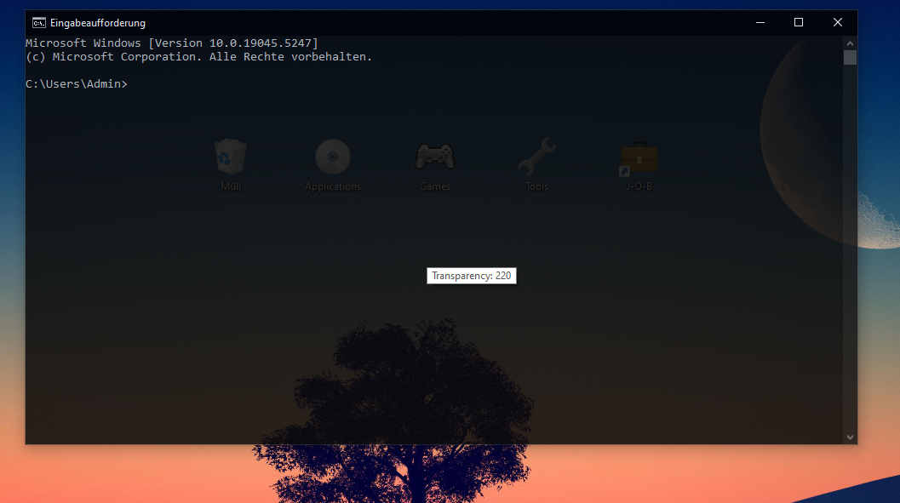

# Window Transparency Toggle Script

A customizable AutoHotkey (AHK) script that allows you to toggle and adjust the transparency of the active window in real-time. The script provides visual feedback via a tooltip showing the current transparency level and offers intuitive keyboard controls to manage window opacity.

---

## Features

- **Toggle Window Transparency**: Easily activate or deactivate the transparency effect on any window.
- **Adjust Transparency in Real-Time**: Control the opacity of the active window using your scroll wheel.
- **Tooltip Feedback**: Displays the current transparency level in a tooltip near your mouse cursor.
- **Full Transparency Control**: Adjust window transparency from fully opaque (255) to completely transparent (0).

---

## Controls

- **Toggle Transparency**:  
  `CTRL + ALT + Right Mouse Button (RMB)`  
  Activates or deactivates window transparency for the currently focused window. When enabled, a tooltip will show the current transparency level.

- **Decrease Transparency**:  
  `CTRL + ALT + Scroll Down`  
  Decreases the transparency by 10 units (down to 0, which is fully transparent).

- **Increase Transparency**:  
  `CTRL + ALT + Scroll Up`  
  Increases the transparency by 10 units (up to 255, which is fully opaque).

---

## How It Works

1. **Activation**:  
   Hold `CTRL + ALT` and right-click anywhere inside the window you wish to modify. This enables transparency with an initial value of 220.
   
2. **Adjusting Transparency**:  
   Use `CTRL + ALT + Scroll Down` to make the window more transparent, or `CTRL + ALT + Scroll Up` to make it more opaque.
   
3. **Tooltip**:  
   When transparency is adjusted, a tooltip will appear near your mouse cursor showing the current transparency level. The tooltip disappears after 3 seconds.

---

## Customization

- **Transparency Range**:  
  The transparency level starts at 220 (semi-transparent). You can adjust it from 0 (completely transparent) to 255 (completely opaque).

- **Tooltip Duration**:  
  By default, the tooltip will disappear after 3 seconds. You can adjust this duration by modifying the `titleChangeDuration` variable in the script (in milliseconds).

---

## Requirements (ONLY THE .AHK FILE)

- **AutoHotkey**: You need to have AutoHotkey installed to run the .ahk script.  
  [Download AutoHotkey](https://www.autohotkey.com/)

---

## Installation

1. Install [AutoHotkey](https://www.autohotkey.com/).
2. Clone or download this repository to your local machine.
3. Right-click the `*.ahk` script file and select **Run Script** to start controlling window transparency.

You can also fully integrate the script with your system by placing it into your startup folder so you dont need to execute it everytime:
1. Press `Win + R`.
2. Type `shell:startup`
3. Put the script inside the folder. (It works with both files)

---

## Acknowledgements

- [AutoHotkey](https://www.autohotkey.com/): The scripting language used to create this tool.
